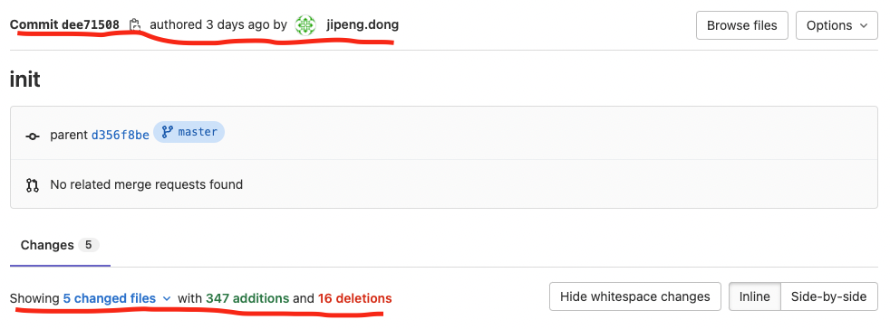
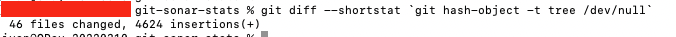
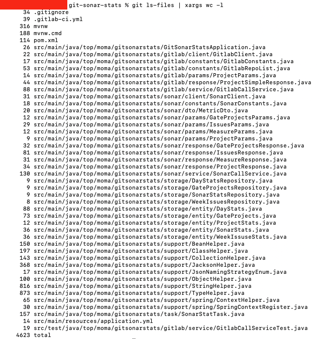

# git-line-count
# 基础：统计标准
代码的统计，最核心的不在于技术，关键在于按照什么标准进行统计。  
更本质一点，LD们是出于什么目的，需要进行代码统计。  
目的一：为了统计非物质项目资产  
目的二：为了核算工作产出，kpi，员工性价比  

针对目的一，代码统计的标准可能就涉及：  
-	不计算无实际业务意义的空行、注释  
-	区分用于通用配置的重复性文件，如log4j.xml  
-	变化量计算通过历史差值进行计算，同时不涉及提交人  
-	变化量可能为负数  

针对目的二，代码统计的标准可能就涉及：
-	是否符合编码规范
-	记录提交人
-	记录新增行数、删除行数
-	明确工作量计算方法（新增+删除或者新增-删除）

基于git进行统计
以gitlab为例，每次git commit信息都包含了提交人，提交时间，新增行数，删除行数
  
因此直观上我们可以根据git仓库的变化信息进行代码行数的统计，注意这里的代码行数是包含空格、注释以及所有文件的。  
而获取git相关提交信息，主要有两种方式，一种是基于git本身的命令，一种是基于gitlab的web api。  
# git命令
基于git命令的前提，是需要先把项目clone到本地。  
然后通过git的diff命令，进行文件之间的比较，快速得到总的代码行数。  
具体的步骤如下：  

## clone项目
```shell
git clone -b <branchName> https://oauth2:<authToken>@test.gitlab.com/testproject.git
```  
- git clone: Clone命令
- -b <branchName>：指定分支
- http://....：仓库地址
- oauth2:<authToken>：通过配置的personal Token实现免登陆  

## 使用git diff命令
```
cd testproject

git diff --shortstat `git hash-object -t tree /dev/null` | tail -1
``` 
- git diff命令同于比较文件之间的不同
- --shortstart，现实简要信息
- git hash-object -t tree /dev/null 用于创建一个空的git 树对象
- tail -1 用于返回最后一行内容  

以上命令会对比当前目录下的文件与空树之间的不同，结果会返回每个文件的变化情况  
  
- 此处显示为**46**个文件有修改，一共**4624**行  

## 使用git ls-files命令
除了git diff外，还可以利用另一个git命令，**git ls-files**进行统计
```  
git ls-files｜ xargs wc -l | tail -1
```
- git ls-files 用于循环项目内所有文件
- xargs wc -l 循环的同时使用wc -l 对文件行数进行计算
- tail -1返回最后一行  


- 此处显示结果**4623**行，比git diff少一行    
- 原因是wc -l根据换行符计算行数，如果文件最后一行没有换行符的话，会导致少一行  

# 结论及扩展
- 使用git diff命令更准确一些
- 当统计多个项目的时候，可以通过shell脚本，for循环，结果输出再汇总的方式完成代码统计


